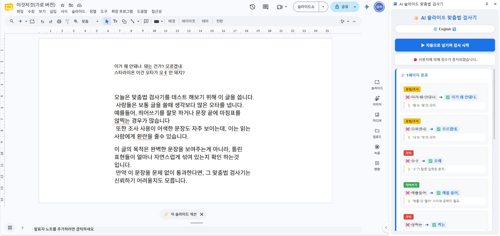
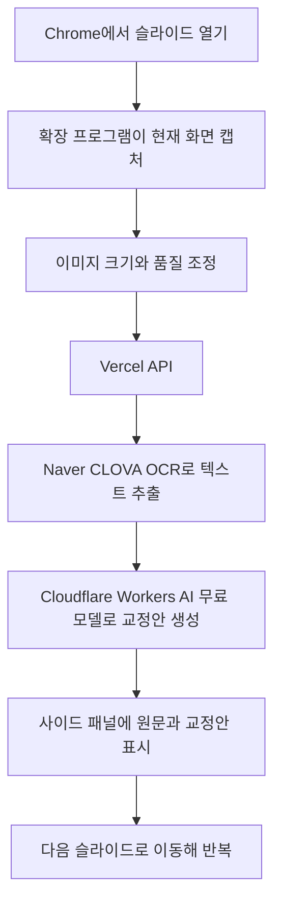

# AI Slide Proofreader

슬라이드 화면을 캡처해 문장을 추출하고, 맞춤법·띄어쓰기·문법 교정안을 보여주는 Chrome 확장 프로그램입니다. 브라우저에서 슬라이드를 넘기며 페이지별 교정 결과를 확인할 수 있습니다.

## 프로젝트 개요

| 항목 | 내용 |
|---|---|
| 해결 과제 | 슬라이드 문장을 복사해 별도 교정 도구에 반복 입력하는 작업을 줄임 |
| 사용자 흐름 | 확장 프로그램 실행 → 슬라이드 분석 → 사이드 패널에서 원문과 교정안 확인 |
| 초기 구성 | 회사 제공 Gemini API와 유료 모델로 교정 처리 |
| 비용 개선 | 퇴사 후 교정 품질을 유지하는 것을 목표로 모델과 워크플로우를 무료 모델 기반으로 재구성 |
| 기술 | Chrome Extension Manifest V3, JavaScript, Vercel API, Naver CLOVA OCR, Cloudflare Workers AI |

## 문제와 목표

슬라이드 문장을 검토하려면 페이지마다 텍스트를 복사해 별도 교정 도구에 입력해야 해 흐름이 끊기고 반복 작업이 발생했습니다. 브라우저에서 슬라이드를 보며 교정안을 확인하도록 화면 캡처, OCR, AI 교정, 결과 표시를 연결했습니다.

초기에는 회사에서 제공한 Gemini API와 유료 모델로 교정했습니다. 퇴사 후에는 모델 사용 비용을 줄이면서 같은 제품 목적과 교정 품질을 유지하는 것을 목표로 처리 구조를 변경했습니다. 이미지에서 텍스트를 읽는 OCR과 문장을 교정하는 AI를 분리하고, 교정 단계에는 무료 모델을 적용했습니다.

## 처리 흐름

## 주요 기능

- 브라우저에서 보이는 슬라이드 화면 캡처 및 분석 요청
- OCR로 추출한 문장의 한국어·영어 맞춤법, 띄어쓰기, 문법 교정
- 의미와 문체를 불필요하게 바꾸지 않도록 최소 수정 기준 적용
- 사이드 패널에서 원문과 교정안을 함께 확인
- 다음 슬라이드로 이동하며 페이지별 분석
- 교정 결과에 대한 사용자 피드백 제출

## 기술 구성

| 구성 요소 | 역할 |
|---|---|
| Chrome Extension Manifest V3 | 화면 캡처, 현재 탭 제어, 사이드 패널 제공 |
| Vercel API | 확장 프로그램 요청을 받고 OCR과 AI 교정 처리 연결 |
| Naver CLOVA OCR | 슬라이드 이미지에서 텍스트 추출 |
| Cloudflare Workers AI | 추출된 문장을 입력받아 교정안 생성 |

## 설계 결정

### OCR과 AI 교정 분리

이미지에서 문자를 추출하는 일과 문장을 교정하는 일을 별도 단계로 나눴습니다. OCR은 전용 인식 서비스로 처리하고, 교정에는 무료 모델을 적용해 유료 Gemini API에 의존하던 흐름을 비용 절감형 구조로 바꿨습니다.

### 교정안은 사용자가 확인

AI가 문장을 전면 재작성하지 않도록 최소 수정 기준을 프롬프트에 반영했습니다. 결과는 확정된 정답이 아니라 사용자가 검토하고 채택하는 제안입니다.

## 내 기여

문제 정의, 사용 흐름 설계, Chrome 확장 프로그램 구현, 서버 처리 구성, 프롬프트 설계, 비용 절감형 모델·워크플로우 전환까지 프로젝트 전 과정을 직접 수행했습니다.

## 결과와 한계

적용 건수, 장당 검토 시간 변화, 교정 결과의 사용자 수정·채택 비율을 별도로 측정하지 않았습니다. 따라서 사용 규모, 시간 절감 효과, 실제 교정 품질을 정량 성과로 제시하지 않습니다. 무료 모델을 적용한 비용 절감형 구조로 변경했지만, 실제 비용 절감액과 유료 모델 대비 품질 차이도 계량 검증하지 않았습니다.

기술적으로 OCR은 글꼴·해상도·배경에 따라 문자를 잘못 인식할 수 있고, AI는 고유명사·전문 용어·의도적인 문체를 오류로 판단할 수 있습니다. 캡처 화면에 보이는 텍스트를 분석하므로 편집 가능한 원본 텍스트를 직접 검사하는 방식과도 차이가 있습니다.

## 데이터 처리와 공개 범위

초기에는 슬라이드 내용이 회사 제공 Gemini API로 전달되어 교정됐습니다. 비용 개선 후에는 캡처 화면을 Vercel API로 보내 Naver CLOVA OCR과 Cloudflare Workers AI를 거쳐 처리합니다. 현재 흐름에서 슬라이드 화면의 내용은 서버와 외부 처리 제공자에게 전달되므로, 이 저장소에는 회사 내부 자료, 실제 사용자 문서, 요청·응답 로그를 포함하지 않습니다.

API 토큰, OCR 인증값, 환경 변수의 실제 값과 계정 식별 정보도 공개하지 않습니다. 시연 이미지가 추가될 경우 가상의 슬라이드만 사용합니다.

